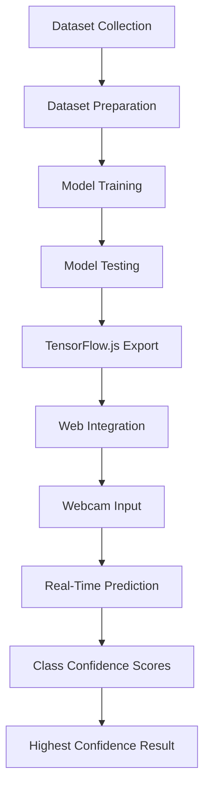

# 📱 PhoneSense

**An AI-powered computer vision module for real-time student phone-usage activity recognition.**

A core module of the **StudentMate AI** ecosystem.

---

## 📌 Project Overview

PhoneSense is an AI-powered computer vision system designed to recognize different student activities involving smartphone usage. Using a webcam and a custom-trained image classification model, PhoneSense delivers real-time predictions directly in the browser — no installation or backend server required.

It is built as one module within the larger **StudentMate AI** project, which aims to understand and support student behavior through multiple AI-driven sensing modules.

---

## ❓ Problem Statement

Smartphone usage during study sessions is a major source of distraction for students. However, not all phone usage is equal — checking a dictionary app or reading study material differs greatly from texting or watching entertainment content. Manually identifying the nature of phone usage is impractical at scale, and most existing tools only detect phone *presence*, not phone *activity type*.

---

## 🎯 Objective

To build a lightweight, browser-based system that can:

- Detect a student's phone-related activity in real time using a webcam
- Classify the activity into meaningful categories (Study, Communication, Entertainment, Unknown)
- Provide instant visual feedback via confidence scores
- Serve as a pluggable sensing module for the broader StudentMate AI system

---

## ⚙️ How PhoneSense Works

1. The user grants webcam access through the browser.
2. Live video frames are captured continuously.
3. Each frame is passed to a Teachable Machine image classification model running via TensorFlow.js.
4. The model outputs confidence scores for all four classes.
5. The class with the highest confidence is highlighted as the current prediction.
6. Results are displayed live on the web interface with per-class confidence percentages.

---

## 🧠 AI Model

| Attribute | Detail |
|---|---|
| **Model Type** | Image Classification |
| **Built With** | Google Teachable Machine |
| **Deployment Framework** | TensorFlow.js |
| **Model URL** | [Teachable Machine Model](https://teachablemachine.withgoogle.com/models/su87NinMB/) |

The model runs entirely client-side in the browser, enabling real-time inference without sending video data to any external server.

---

## 🏷️ Classification Classes

PhoneSense classifies webcam input into **four classes**:

| # | Class | Description |
|---|---|---|
| 1 | **Study** | Phone usage related to studying (e.g., reading material, using study apps) |
| 2 | **Communication** | Phone usage related to messaging or calls |
| 3 | **Entertainment** | Phone usage related to entertainment content |
| 4 | **Unknown** | Activity that does not clearly match the above categories |

---

## 🗂️ Dataset Preparation

A custom image dataset was collected and organized for the four target classes: **Study**, **Communication**, **Entertainment**, and **Unknown**. Images for each class were grouped into separate categories to train the classification model.

To evaluate the model's ability to generalize beyond the training data, a **separate set of test images** — not used during training — was used to assess performance across all four classes.

---

## 🏋️ Model Training

The model was trained using Google Teachable Machine with the following configuration:

| Parameter | Value |
|---|---|
| **Epochs** | 50 |
| **Batch Size** | 16 |
| **Learning Rate** | 0.001 |

After training, the model was exported in **TensorFlow.js** format for direct integration into the web application.

---

## 🧪 Testing and Evaluation

The trained model was tested across **all four classes** using a separate set of test images to evaluate generalization performance.

> ⚠️ **Confidence vs. Accuracy:**
> Observed **prediction confidence** during testing was approximately **85%–100%** across the classes. This reflects how certain the model was for a given prediction — it is **not** a formally measured accuracy score derived from a labeled evaluation dataset. No claim of 100% accuracy is made anywhere in this project. Prediction confidence and classification accuracy are distinct metrics, and only confidence values were observed during testing.

---

## 🌐 Web Application

PhoneSense is implemented as a **single-file web application**. The complete frontend — including HTML, CSS, and JavaScript — is contained within `index.html`. The application performs all inference client-side and does not require a backend server.

**Built With:**
- HTML5
- CSS3
- JavaScript
- TensorFlow.js
- Teachable Machine Image Library
- Webcam / browser camera access

**Functionality:**
- Requests webcam permission from the user
- Displays a real-time webcam preview
- Sends camera frames to the trained model for inference
- Performs real-time AI image classification
- Displays confidence percentages for all classes
- Highlights the highest-confidence prediction
- Provides a **Start PhoneSense** button
- Provides a **Stop Camera** button
- Features a responsive, modern user interface

---

## ✨ Key Features

- 🎥 Real-time webcam-based activity classification
- 🧠 Client-side AI inference using TensorFlow.js (no server required)
- 📊 Live confidence scores displayed for all classes
- ✅ Clear highlighting of the top prediction
- ▶️ Start PhoneSense and Stop Camera controls
- 📱 Responsive, modern UI design
- 🧩 Modular design for integration with StudentMate AI

---

## 🔄 System Workflow



---

## 🛠️ Technologies Used

| Category | Technology |
|---|---|
| Model Training | Google Teachable Machine |
| Model Deployment | TensorFlow.js |
| Frontend | HTML5, CSS3, JavaScript |
| Inference Library | Teachable Machine Image Library |
| Input Source | Webcam / Browser Camera Access |

---

## 📁 Project Structure

```text
StudentMate-AI/
└── PhoneSense/
    ├── index.html
    └── README.md
```

The complete application — including all HTML structure, CSS styling, and JavaScript logic for camera handling and model inference — is contained entirely within `index.html`.

---

## 🚀 How to Run

1. Clone the **StudentMate-AI** repository.
2. Navigate into the **PhoneSense** folder.
3. Run the project using **VS Code Live Server** or another local HTTPS/localhost server.
4. Alternatively, access the deployed **GitHub Pages** version.
5. Allow camera permission when prompted.
6. Click **Start PhoneSense**.
7. View real-time predictions.

```bash
git clone https://github.com/Devika-2006/StudentMate-AI.git
cd StudentMate-AI/PhoneSense
```

> ⚠️ **Note:** Opening `index.html` directly via `file://` may prevent camera access from working correctly in some browsers. It is recommended to run the application through a local server (e.g., VS Code Live Server) or the deployed GitHub Pages link.

---

## 🔐 Camera Permissions

PhoneSense requires webcam access to function. When you click **Start PhoneSense**, your browser will prompt you to allow camera permissions.

- All video processing happens **locally in the browser**.
- No video frames are uploaded or stored externally.
- If permission is denied, the application will be unable to perform real-time classification.

---

## 🤝 Contribution

This module is developed and maintained by **[Devika-2006](https://github.com/Devika-2006)** as part of the StudentMate AI project.

Contributions, suggestions, and issue reports are welcome. To contribute:

1. Fork the repository: [StudentMate-AI](https://github.com/Devika-2006/StudentMate-AI)
2. Create a feature branch (`git checkout -b feature/your-feature`)
3. Commit your changes
4. Open a Pull Request

---

## 🔮 Future Improvements

- Expanding the dataset for improved generalization across varied environments
- Conducting formal accuracy evaluation using labeled validation datasets
- Enhancing UI/UX with additional real-time analytics
- Integrating PhoneSense output with the central StudentMate AI dashboard

---

## 📊 Project Status

🟢 **Active** — Core functionality (real-time classification via webcam) is implemented and functional. Further refinements are ongoing as part of the StudentMate AI integration effort.

---

## 🧩 StudentMate AI Integration

PhoneSense is one of **three modules** that together form the **StudentMate AI** system — a multi-module AI framework for understanding student behavior through complementary sensing approaches.

| Module | Contributor | Focus |
|---|---|---|
| 📱 PhoneSense | Devika-2006 | Camera/image-based phone activity detection |
| 🎤 FocusGuard | mahikha-025 | Audio/environment classification |
| 🧍 PoseMate | lekkauma09 | Pose/activity recognition |

Each module operates independently but contributes to a unified vision of intelligent, multi-modal student behavior monitoring under the **StudentMate AI** umbrella.

---

<div align="center">

**Developed by [Devika-2006](https://github.com/Devika-2006)** · Part of the **StudentMate AI** Project

</div>
