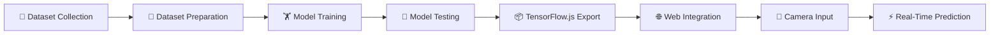

# 📱 PhoneSense

**An AI-powered computer vision module for real-time student phone-usage activity recognition.**

> A core module of the [**StudentMate AI**](#-studentmate-ai-integration) ecosystem.

---

## 1. 📌 Project Overview

**PhoneSense** is an AI-powered computer vision system designed to recognize different student activities involving smartphone usage. Using a webcam and a custom-trained image classification model, PhoneSense delivers real-time predictions directly in the browser — no installation or backend server required.

It is built as one module within the larger **StudentMate AI** project, which aims to understand and support student behavior through multiple AI-driven sensing modules.

---

## 2. ❓ Problem Statement

Smartphone usage during study sessions is a major source of distraction for students. However, not all phone usage is equal — checking a dictionary app or reading study material differs greatly from texting or watching entertainment content. Manually identifying the *nature* of phone usage is impractical at scale, and most existing tools only detect phone *presence*, not phone *activity type*.

---

## 3. 🎯 Objective

To build a lightweight, browser-based system that can:

- Detect a student's phone-related activity in real time using a webcam
- Classify the activity into meaningful categories (Study, Communication, Entertainment, Unknown)
- Provide instant visual feedback via confidence scores
- Serve as a pluggable sensing module for the broader StudentMate AI system

---

## 4. ⚙️ How PhoneSense Works

1. The user grants webcam access through the browser.
2. Live video frames are captured continuously.
3. Each frame is passed to a Teachable Machine image classification model running via TensorFlow.js.
4. The model outputs confidence scores for all four classes.
5. The class with the highest confidence is highlighted as the current prediction.
6. Results are displayed live on the web interface with per-class confidence percentages.

---

## 5. 🧠 AI Model

| Attribute | Detail |
|---|---|
| **Model Type** | Image Classification |
| **Built With** | Google Teachable Machine |
| **Deployment Framework** | TensorFlow.js |
| **Model URL** | [Teachable Machine Model](https://teachablemachine.withgoogle.com/models/su87NinMB/) |

The model runs entirely client-side in the browser, enabling real-time inference without sending video data to any external server.

---

## 6. 🏷️ Classification Classes

PhoneSense classifies webcam input into **four classes**:

| # | Class | Description |
|---|---|---|
| 1 | **Study** | Phone usage related to studying (e.g., reading material, using study apps) |
| 2 | **Communication** | Phone usage related to messaging or calls |
| 3 | **Entertainment** | Phone usage related to entertainment content |
| 4 | **Unknown** | Activity that does not clearly match the above categories |

---

## 7. 🗂️ Dataset Preparation

A custom image dataset was collected and organized for the four target classes: **Study**, **Communication**, **Entertainment**, and **Unknown**. Images for each class were grouped into separate categories to train the classification model.

To evaluate the model's ability to generalize beyond the training data, a **separate set of test images** — not used during training — was used to assess performance across all four classes.

---

## 8. 🏋️ Model Training

The model was trained using Google Teachable Machine with the following configuration:

| Parameter | Value |
|---|---|
| **Epochs** | 50 |
| **Batch Size** | 16 |
| **Learning Rate** | 0.001 |

After training, the model was exported in **TensorFlow.js** format for direct integration into the web application.

---

## 9. 🧪 Testing and Evaluation

The trained model was tested across **all four classes** using a separate set of test images to evaluate generalization performance.

> ⚠️ **Note on Confidence vs. Accuracy:**
> Observed **prediction confidence** during testing was approximately **85%–100%** across the classes. This reflects the model's confidence scores on test inputs and **should not be interpreted as a formal accuracy metric**. No claim of 100% accuracy is made — confidence values indicate the model's certainty for a given prediction, not a validated accuracy benchmark.

---

## 10. 🌐 Web Application

PhoneSense includes a browser-based interface built entirely with front-end web technologies — requiring no backend server for inference.

**Built With:**
- HTML5
- CSS3
- JavaScript
- TensorFlow.js
- Teachable Machine Image Library

**Functionality:**
- Requests webcam permission from the user
- Displays the live camera feed
- Sends camera frames to the trained model for inference
- Performs real-time classification
- Displays confidence percentages for every class
- Highlights the highest-confidence prediction
- Provides **Start** and **Stop** camera controls
- Features a responsive and modern user interface

---

## 11. ✨ Key Features

- 🎥 Real-time webcam-based activity classification
- 🧠 Client-side AI inference using TensorFlow.js (no server required)
- 📊 Live confidence scores displayed for all classes
- ✅ Clear highlighting of the top prediction
- ▶️ Simple Start/Stop camera controls
- 📱 Responsive, modern UI design
- 🧩 Modular design for integration with StudentMate AI

---

## 12. 🔄 System Workflow



---

## 13. 🛠️ Technologies Used

| Category | Technology |
|---|---|
| Model Training | Google Teachable Machine |
| Model Deployment | TensorFlow.js |
| Frontend | HTML5, CSS3, JavaScript |
| Inference Library | Teachable Machine Image Library |

---

## 14. 📁 Project Structure
PhoneSense/
├── index.html # Main web application interface
├── style.css # Styling for the web application
├── script.js # Camera handling & model inference logic
└── README.md # Project documentation


> 📝 Structure reflects the core files of the web application. Adjust file names/paths as per your actual repository layout.

---

## 15. 🚀 How to Run

1. **Clone the repository**
```bash
   git clone https://github.com/Devika-2006/PhoneSense.git
   cd PhoneSense
```

2. **Open the application**
   Simply open `index.html` in a modern web browser (Chrome recommended).

   Alternatively, serve it locally:
```bash
   npx serve .
```

3. **Start the classifier**
   - Click **Start** to enable the webcam and begin real-time classification.
   - Click **Stop** to end the session and release the camera.

---

## 16. 🔐 Camera Permissions

PhoneSense requires **webcam access** to function. When you click **Start**, your browser will prompt you to allow camera permissions.

- All video processing happens **locally in the browser**.
- No video frames are uploaded or stored externally.
- If permission is denied, the application will be unable to perform real-time classification.

---

## 17. 🤝 Contribution

This module is developed and maintained by **[Devika-2006](https://github.com/Devika-2006)** as part of the StudentMate AI project.

Contributions, suggestions, and issue reports are welcome. To contribute:

1. Fork the repository
2. Create a feature branch (`git checkout -b feature/your-feature`)
3. Commit your changes
4. Open a Pull Request

---

## 18. 🔮 Future Improvements

- Expanding the dataset for improved generalization across varied environments
- Exploring formal accuracy evaluation using labeled validation datasets
- Enhancing UI/UX with additional real-time analytics
- Integrating PhoneSense output with the central StudentMate AI dashboard

---

## 19. 📊 Project Status

🟢 **Active** — Core functionality (real-time classification via webcam) is implemented and functional. Further refinements are ongoing as part of the StudentMate AI integration effort.

---

## 20. 🧩 StudentMate AI Integration

**PhoneSense** is one of **three modules** that together form the **StudentMate AI** system — a multi-module AI framework for understanding student behavior through complementary sensing approaches.

| Module | Contributor | Focus Area |
|---|---|---|
| 📱 **PhoneSense** | [Devika-2006](https://github.com/Devika-2006) | Camera/image-based phone activity detection |
| 🎧 **FocusGuard** | mahikha-025 | Audio/environment classification |
| 🧍 **PoseMate** | lekkauma09 | Pose/activity recognition |

Each module operates independently but contributes to a unified vision of intelligent, multi-modal student behavior monitoring under the **StudentMate AI** umbrella.

---

<div align="center">

**Developed by [Devika-2006](https://github.com/Devika-2006)** · Part of the **StudentMate AI** Project

</div>
